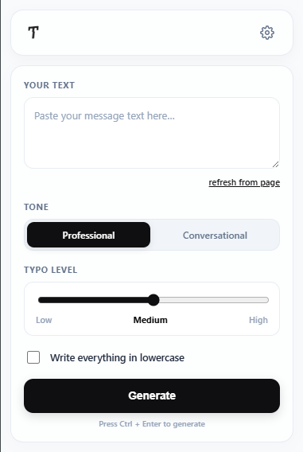
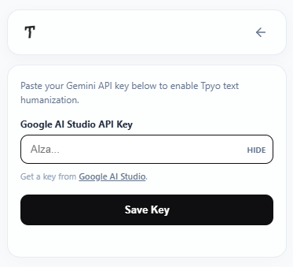
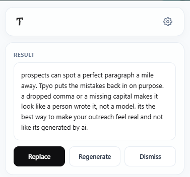

# Tpyo

Humanize your response.

Tpyo is a Chrome extension that rewrites AI-drafted cold emails and DMs so they read like a person typed them, not a model. It works right inside the text field you're already typing in — no copying text into another tab, no separate chat window.

Most AI writing tools optimize for sounding polished. Tpyo does the opposite on purpose: it can drop in a believable typo here and there, skip the odd comma, and even write in all lowercase if you want it to. That's the point — a message with zero mistakes in it doesn't read as effort anymore, it reads as generated.

## Screenshots

**Main interface**

**Adding your API key**

**A generated response**

## How it works

1. Click the Tpyo icon while your cursor is in a text field, or paste your draft into the panel directly.
2. Pick a tone (Professional or Conversational).
3. Set the typo level (Low, Medium, or High), and turn on lowercase mode if you want.
4. Click Generate. The rewritten text drops straight back into the field.

Under the hood, Tpyo sends your draft to the Gemini API along with a prompt that tells the model how to write it: keep the meaning, cut the words that give AI writing away (delve, leverage, circle back, and the rest), vary the sentence rhythm, and work in a small, natural number of typos depending on the level you picked. If the text you paste in is too vague or doesn't make sense, it won't guess — it'll ask you for more context instead of making something up.

## Getting started

1. Clone or download this repo.
2. Go to `chrome://extensions`, turn on Developer mode, and click "Load unpacked."
3. Select the project folder.
4. Click the Tpyo icon in your toolbar and open Settings.
5. Paste in your own Gemini API key. You can get one from [Google AI Studio](https://aistudio.google.com/apikey).
6. That's it — open any text field, click the icon, and start generating.

Your API key stays on your machine. It's stored in Chrome's local storage and is only ever sent directly to Google's API, never to any server of ours, because there isn't one.

## Permissions

- `storage` — saves your API key and settings locally.
- `activeTab` / `scripting` — lets the panel read the text field you're working in and write the result back into it.
- `contextMenus` — adds Tpyo to the right-click menu.
- Access to `generativelanguage.googleapis.com` — the only external service this extension talks to, used to call the Gemini API with your key.

## Built with

- Manifest V3
- Vanilla JavaScript, no framework
- Gemini API

## Notes

This is an early build. If something reads too stiff, too sloppy, or just off, open an issue — the prompt is the whole product here, and it's worth getting right.

## License

MIT